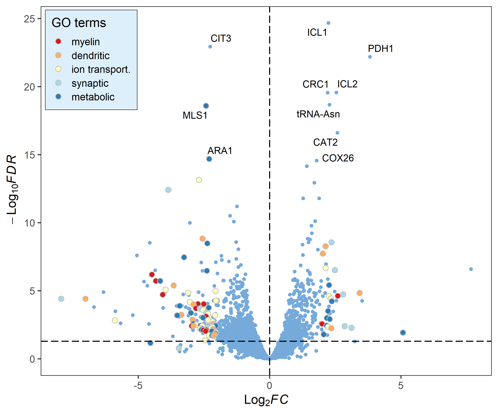

<!-- README.md is generated from README.Rmd. Please edit that file -->


# ggVolcano

<!-- badges: start -->
<!-- badges: end -->

The goal of `ggVolcano` is to help users make a beautiful volcano map more easily, including general volcano plot(`ggvolcano`), gradient color volcano plot(`gradual_volcano`) and GO term volcano plot(`term_volcano`).

## Installation

You can install the development version of `ggVolcano` like so:

``` r
# install.packages("devtools")
devtools::install_github("BioSenior/ggvolcano")
```

## Use function `ggvolcano` to make a general volcano plot.
### basic use
- Make sure you have a DEG result data containing information on differentially expressed genes (including GeneName, Log2FC, pValue, FDR).
- If your data don't have a column named ‘regulate’, you can use the `add_regulate` function to add.
- Use function `ggvolcano` to make a general volcano plot. You can use `?ggvolcano` to see the parameters of the function.


```r
library(ggVolcano)

## basic example code
# load the data
data(deg_data)

# use the function -- add_regulate to add a regulate column 
# to the DEG result data. 
data <- add_regulate(deg_data, log2FC_name = "log2FoldChange",
                     fdr_name = "padj",log2FC = 1, fdr = 0.05)

# plot
ggvolcano(data, x = "log2FoldChange", y = "padj",
          label = "row", label_number = 10, output = FALSE)
```


> - You must set x and y to the corresponding column names in your data.
> - If you want to add label to the points, please set label to the corresponding column names in your data. And the label_number parameter can adjust the number of displayed labels.(Select the top label_number genes in terms of FDR value.)

### Change the fill and the color

```r
# Change the fill and color manually:
p1 <- ggvolcano(data, x = "log2FoldChange", y = "padj",
          fills = c("#e94234","#b4b4d8","#269846"),
          colors = c("#e94234","#b4b4d8","#269846"),
          label = "row", label_number = 10, output = FALSE)

p2 <- ggvolcano(data, x = "log2FoldChange", y = "padj",
          label = "row", label_number = 10, output = FALSE)+
  ggsci::scale_color_aaas()+
  ggsci::scale_fill_aaas()
#> Scale for 'colour' is already present. Adding another scale for 'colour', which
#> will replace the existing scale.
#> Scale for 'fill' is already present. Adding another scale for 'fill', which
#> will replace the existing scale.

library(patchwork)
p1|p2
```


## Use function `gradual_volcano` to make a gradient color volcano plot.
### basic use
- Make sure you have a DEG result data containing information on differentially expressed genes (including GeneName, Log2FC, pValue, FDR).
- If your data don't have a column named ‘regulate’, you can use the `add_regulate` function to add.
- Use function `ggvolcano` to make a general volcano plot. You can use `?gradual_Volcano` to see the parameters of the function.


```r
# plot
gradual_volcano(deg_data, x = "log2FoldChange", y = "padj",
                label = "row", label_number = 10, output = FALSE)
```


### Change the fill and the color

```r
library(RColorBrewer)

# Change the fill and color manually:
p1 <- gradual_volcano(data, x = "log2FoldChange", y = "padj",
          fills = brewer.pal(5, "RdYlBu"),
          colors = brewer.pal(8, "RdYlBu"),
          label = "row", label_number = 10, output = FALSE)

p2 <- gradual_volcano(data, x = "log2FoldChange", y = "padj",
          label = "row", label_number = 10, output = FALSE)+
  ggsci::scale_color_gsea()+
  ggsci::scale_fill_gsea()
#> Scale for 'colour' is already present. Adding another scale for 'colour', which
#> will replace the existing scale.
#> Scale for 'fill' is already present. Adding another scale for 'fill', which
#> will replace the existing scale.

library(patchwork)
p1|p2
```


> - If you want to adjust the size range of the points, you can use `pointSizeRange = c(min_size,max_size)`.


## Use function `term_volcano` to make a GO term volcano plot.
### basic use
- Make sure you have a DEG result data containing information on differentially expressed genes (including GeneName, Log2FC, pValue, FDR).
- Except a DEG result data, you also need a term data which is a two columns dataframe containing some genes' GO terms information.
- If your data don't have a column named ‘regulate’, you can use the `add_regulate` function to add.
- Use function `ggvolcano` to make a general volcano plot. You can use `?term_Volcano` to see the parameters of the function.


```r
data("term_data")

# plot
term_volcano(deg_data, term_data,
             x = "log2FoldChange", y = "padj",
             label = "row", label_number = 10, output = FALSE)
```


### Change the fill and the color

```r
library(RColorBrewer)

# Change the fill and color manually:
deg_point_fill <- brewer.pal(5, "RdYlBu")
names(deg_point_fill) <- unique(term_data$term)

term_volcano(data, term_data,
             x = "log2FoldChange", y = "padj",
             normal_point_color = "#75aadb",
             deg_point_fill = deg_point_fill,
             deg_point_color = "grey",
             legend_background_fill = "#deeffc",
             label = "row", label_number = 10, output = FALSE)
```


> Welcome to pay attention to the BioSenior to get more practical tutorials on scientific mapping!


